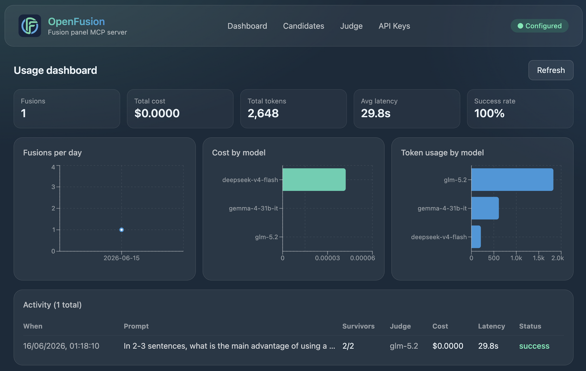

<p align="center">
  
</p>

<p align="center">
  <strong>Frontier-grade answers from any mix of models — now in your own MCP server.</strong>
</p>

<p align="center">
  <a href="https://github.com/hashangit/openfusion/releases"></a>
  <a href="./LICENSE"></a>
  <a href="https://nodejs.org"></a>
  <a href="https://www.typescriptlang.org/"></a>
  <a href="https://modelcontextprotocol.io/"></a>
  
  <a href="./CONTRIBUTING.md"></a>
</p>

---

OpenRouter showed that **synthesizing the outputs of several models consistently beats any single frontier model** — and that you don't even need expensive models to get there. In [their Fusion announcement](https://openrouter.ai/blog/announcements/fusion-beats-frontier/), a panel of cheap models fused together **outperformed solo frontier models** on deep-research tasks, landing within striking distance of top-tier models at a fraction of the cost.

**The catch:** you had to use OpenRouter.

**OpenFusion removes that catch.** It's a local [MCP](https://modelcontextprotocol.io/) server that brings the exact same Fusion architecture to **any** MCP-capable coding agent or client — Claude Code, Cursor, Cline, Zed, Codex, Gemini CLI, Continue, and [18+ others](./INSTALL.md). Bring your own keys for any provider; OpenFusion runs entirely on your machine.

> ### ✨ The Fable 5 opportunity
> OpenRouter's headline finding: a budget panel of cheap models, fused, landed **within ~1% of Claude Fable 5** on deep research — at roughly half the price. **OpenFusion lets you build that budget panel yourself, with the cheapest models from any providers you like.** Fable-5-class answers, at budget-panel cost, from the agent you already use.

## How it works

OpenFusion is a **fusion engine, not an agent**. It doesn't browse, doesn't call tools, doesn't do research itself — you give it the prompt (and any context you've gathered), and it does one thing very well:

```
your prompt ──► fan out to 2–5 candidate models (parallel, single-shot)
                   │  Promise.allSettled + per-candidate timeout
                   ▼
              survivors (≥2 required)
                   │
                   ▼  judge step 1: structured analysis
              { consensus · contradictions · partial coverage · unique insights · blind spots }
                   │
                   ▼  judge step 2: synthesis (candidates + analysis only)
              one consolidated answer  ◄── returned to your agent
```

The two-step judge is the magic. OpenRouter found that **~¾ of the performance lift comes from the synthesis step itself**, not just model diversity — splitting "analyze the candidates" from "write the final answer" is what makes the output measurably better than any single contributor. Both steps use the same judge model you configure.

Every fusion is logged to a local SQLite database and visualized in a glass-morphic dashboard — per-model cost, tokens, and latency, with each fusion expandable into its constituent calls.

## Why you'd use it

- **Complex reasoning & architecture decisions** where a second (and third) opinion genuinely helps.
- **Deep research & source synthesis** across multiple perspectives.
- **Cross-model verification** for high-stakes answers where independent agreement builds confidence.
- **Budget-conscious quality** — a panel of cheap models, fused, can beat a single expensive one.

And when *not* to: routine coding, simple lookups, single-turn Q&A. Fusion is 2–3× slower and costlier than one call, so the shipped [`SKILL.md`](./skill/SKILL.md) teaches your agent to reach for it selectively.

## Install

Requires **Node.js 22+**. (Published to npm — no clone needed for most users.)

### One-command setup (recommended)

```bash
npx openfusion-setup
```

This asks which MCP client you use, generates the correct config snippet (`npx -y openfusion-mcp` as the server command), writes it to the right file when safe, and offers to install the agent skill.

### Or: register manually

Point your MCP client at `npx -y openfusion-mcp` (or `node /path/to/openfusion/dist/index.js` if you cloned). See **[INSTALL.md](./INSTALL.md)** for exact recipes for 18+ clients (Claude Code, Cursor, Cline, Zed, Codex, Gemini CLI, ZCode, Claude Desktop, …). For **Claude Code** and **ZCode**, the repo's [`.mcp.json`](./.mcp.json) auto-loads when you open the project.

### First run

Start the server and, on first run, OpenFusion prints a banner to stderr and **opens the dashboard**:

```bash
npx -y openfusion-mcp
# → a browser opens at http://localhost:9077 to configure candidates, judge, and API keys
```

### From source

```bash
git clone https://github.com/hashangit/openfusion.git && cd openfusion
pnpm install && pnpm build     # tsc -> dist/ ; vite -> ui-dist/
node dist/index.js
```

> **Native build note:** `better-sqlite3` compiles a native addon at install. On most platforms a prebuilt binary is fetched automatically. If install fails, run `npm rebuild better-sqlite3` (requires Python 3 + a C++ toolchain — Xcode CLT on macOS, `build-essential` on Linux). If the addon is missing at runtime, OpenFusion prints a clear fix-it message instead of a cryptic stack trace.

## Where data lives

OpenFusion stores config, encrypted keys, and the SQLite DB under `OPENFUSION_HOME` — defaulting to your OS data dir (`~/Library/Application Support/openfusion` on macOS, `~/.local/share/openfusion` on Linux). The **path is printed on every startup**, so you always know where your config/secrets are. Set `OPENFUSION_HOME` to override (e.g. for a separate profile). Restart the server after changing it — two servers with different `OPENFUSION_HOME`s see different configs.

## Configure

1. Open **http://localhost:9077** (start the dashboard anytime with `node dist/ui-only.js`).
2. Add **2–5 candidate models** (provider + model each), pick a **judge**, and enter an **API key** per referenced provider. Use **Test** to validate each before saving.
3. The **● Configured** badge turns green → the `fusion` tool works immediately (no restart).

Keys are AES-256-GCM encrypted at rest (`secrets.enc` + a chmod-600 machine-bound `master.key`); the dashboard binds to `127.0.0.1` only.

## Tools

| Tool | Input | Returns |
|------|-------|---------|
| `fusion` | `{ prompt, context? }` | one consolidated answer (+ progress notifications) |
| `open_dashboard` | `{}` | opens `http://localhost:9077` |

## The dashboard

<p align="center">
  
</p>

<p align="center"><em>Glass-morphic, OpenFusion-branded · KPIs · fusions-per-day · cost-by-model · token-usage-by-model · expandable activity log</em></p>

Every fusion writes **one activity row + N+2 sub-call rows** (each candidate + the two judge steps) — so you can see exactly which model said what, cost how much, and took how long. That's the "activity as a dimension" powering the charts.

## Tech

TypeScript (ESM, ES2022, NodeNext) · [`@earendil-works/pi-ai`](https://www.npmjs.com/package/@earendil-works/pi-ai) (provider layer) · [`@modelcontextprotocol/sdk`](https://modelcontextprotocol.io/) v1 · [`better-sqlite3`](https://github.com/WiseLibs/better-sqlite3) · Express 5 (loopback-only) · React + Vite + Tailwind + recharts · Vitest.

## Scripts

```bash
npx openfusion-setup       # interactive installer (writes client config + installs skill)
npx openfusion-mcp         # run the MCP server + dashboard
pnpm build                 # tsc -> dist/ ; vite -> ui-dist/ (from source)
pnpm test                  # 50 tests, deterministic (pi-ai faux providers — no real API calls)
node dist/index.js         # MCP server (stdio) + dashboard (from source)
node dist/ui-only.js       # standalone always-on dashboard
```

## Updating

```bash
git pull && pnpm install && pnpm build   # from source; or just re-run npx for the published version
```

Then **restart the server** so it loads the new code — a running process won't pick up changes. Config schema upgrades are automatic on load (a one-time notice prints to stderr, e.g. `config upgraded from v1 → v2`). You won't lose your candidates/judge/keys.

> **Client tool-call timeouts:** a fusion with several candidates + a judge can take ~30–90s (sometimes more). Some MCP clients enforce a tight tool-call ceiling (e.g. 60s). If a `fusion` call appears to fail from the client side, the server likely **completed and logged it anyway** — check the **Generations** or **Errors** tab in the dashboard (`http://localhost:9077`) for the result.

## Project layout

```
src/        server (fusion engine, MCP, REST API, config, SQLite) — see ARCHITECTURE.md
ui/         React dashboard (Vite + Tailwind + recharts)
skill/      SKILL.md — agent guidance, shipped with the package
specs/      speckit design record (spec / plan / contracts / tasks)
public/     logo + banner
```

## Contributing

Contributions welcome — see **[CONTRIBUTING.md](./CONTRIBUTING.md)**. The project has a [constitution](./.specify/memory/constitution.md) of seven design principles that changes must respect. AGENTS.md has the coding guidelines.

## Acknowledgements

- **[OpenRouter](https://openrouter.ai)** for the [Fusion research and architecture](https://openrouter.ai/blog/announcements/fusion-beats-frontier/) that this project implements locally.
- **[pi-ai](https://github.com/earendil-works/pi)** (Mario Zechner / earendil-works) for the excellent multi-provider LLM abstraction.
- The **[Model Context Protocol](https://modelcontextprotocol.io/)** team for the open standard this plugs into.

## License

[MIT](./LICENSE) © Hashan Wickramasinghe

---

<p align="center">
  <em>Frontier-grade fusion. Any providers. Your machine. No lock-in.</em>
</p>

<p align="center">
  <a href="https://github.com/hashangit/openfusion">
    
  </a>
  &nbsp;
  <a href="https://github.com/hashangit/openfusion">
    
  </a>
</p>
